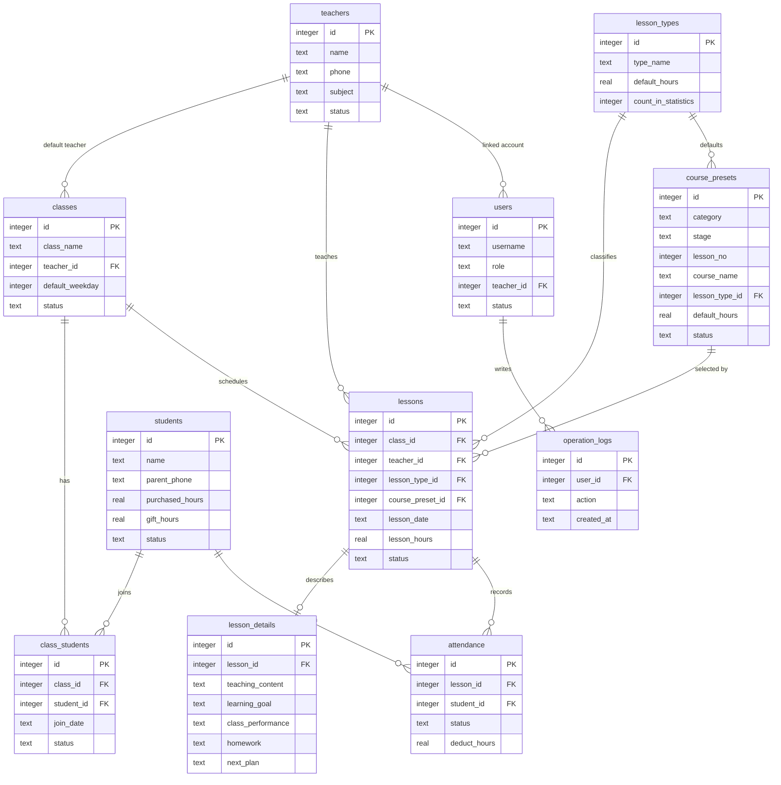

# 数据库关系说明

> 更新时间：2026-05-16
>
> 数据库文件：`E:\moran_project\class_worker\data\attendance.db`

## 核心关系



## 推荐查询视图

| 视图 | 说明 |
|---|---|
| `v_students_summary` | 学生课时、出勤、班级汇总 |
| `v_class_roster` | 班级花名册，关联班级、学生、默认老师 |
| `v_lessons_detail` | 课次详情，关联班级、老师、课程类型、预设课程、课程详情状态、出勤统计 |
| `v_lesson_details` | 每节课课程详情，关联课次、班级、老师、课程类型、预设课程 |
| `v_attendance_detail` | 签到明细，关联课次、学生、班级、老师、课程类型 |
| `v_teacher_lesson_summary` | 教师授课汇总 |
| `v_class_lesson_summary` | 班级课次和出勤汇总 |
| `v_student_monthly_attendance` | 学生月度出勤和扣课时汇总 |

## 主要外键关系说明

| 来源表 | 字段 | 关联表 | 说明 |
|---|---|---|---|
| `classes` | `teacher_id` | `teachers.id` | 班级默认老师 |
| `class_students` | `class_id` | `classes.id` | 班级学生关联 |
| `class_students` | `student_id` | `students.id` | 学生加入班级 |
| `lessons` | `class_id` | `classes.id` | 课次所属班级 |
| `lessons` | `teacher_id` | `teachers.id` | 课次上课老师 |
| `lessons` | `lesson_type_id` | `lesson_types.id` | 课次课程类型 |
| `course_presets` | `lesson_type_id` | `lesson_types.id` | 预设课程默认课程类型 |
| `lessons` | `course_preset_id` | `course_presets.id` | 课次选择的预设课程 |
| `lesson_details` | `lesson_id` | `lessons.id` | 课程详情所属课次 |
| `attendance` | `lesson_id` | `lessons.id` | 签到所属课次 |
| `attendance` | `student_id` | `students.id` | 签到所属学生 |
| `users` | `teacher_id` | `teachers.id` | 老师账号关联教师资料 |
| `operation_logs` | `user_id` | `users.id` | 操作日志关联账号 |

## 数据库软件连接方式

1. 选择 SQLite 连接。
2. 数据库文件选择：

```text
E:\moran_project\class_worker\data\attendance.db
```

3. 打开连接后重点查看：

```text
Tables
Views
Indexes
```

4. 查询优先使用 `v_` 开头的视图。

## 后续可扩展实体

后续如果继续完善系统，建议新增以下实体：

1. `student_hour_transactions`：课时购买、赠送、扣减流水。
2. `student_feedback`：学生课堂表现。
3. `trial_students`：试听学生管理。
4. `system_settings`：系统配置，例如低课时提醒阈值、备份保留天数。
