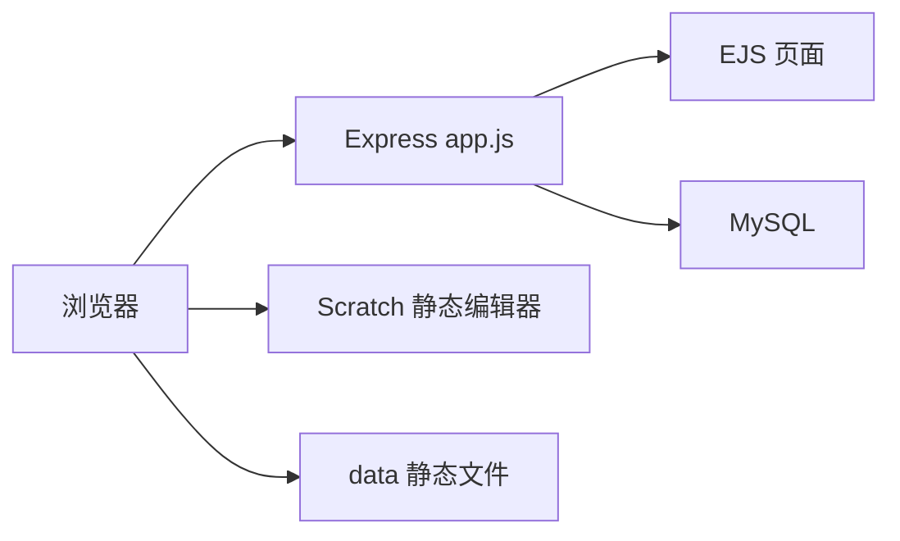
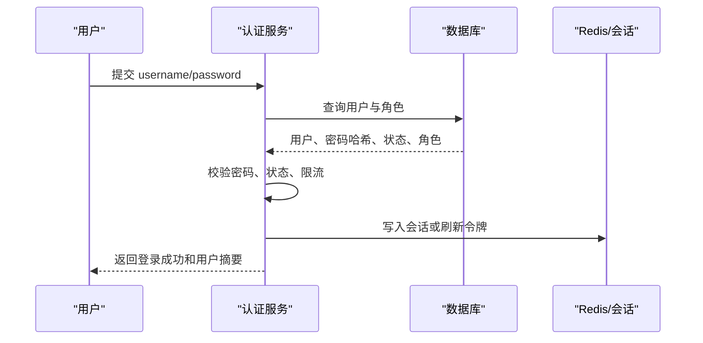
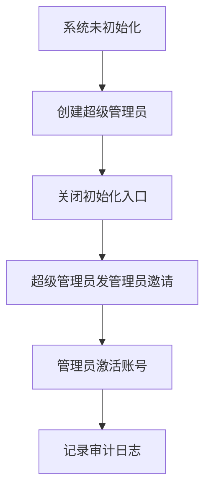

# ScratchLite 参考补充与平台方案优化技术文档

版本：v2.1 补充版  
日期：2026-06-05  
新增参考：`yanhaogg0830/ScratchLite`  
关联主文档：`moran-007 GitHub深度扫描与平台优化技术文档.md`  
当前重点：Scratch 上课/备课、导入课件与模板作品、登录功能、管理员注册功能

## 1. 补充扫描结论

在前一版扫描中，平台主线已经比较清晰：

```txt
ceshi003：课程、班级、课次、学生、教师、签到、课消等业务底座
hydro_scratch：Scratch 题目、编辑器、模板、提交、预览、评分、自动测评
hydro_points：积分流水、签到、商城、称号、作业/比赛结算
```

新增参考 `ScratchLite` 后，结论需要补充但不需要推翻：

- `ScratchLite` 的价值主要在产品闭环：注册登录、Scratch/Python 创作、作品管理、作品播放、点赞、收藏、分享、默认作品、素材库、后台批量账号。
- `ScratchLite` 更像一个轻量级“创作与分享平台”，而不是完整的培训机构“上课/备课/班级/课次/作业/评价”系统。
- 当前平台仍应以 `ceshi003 + hydro_scratch + hydro_points` 为主干，`ScratchLite` 作为素材库、默认作品、作品社区、批量账号和管理后台交互的参考样本。
- `ScratchLite` 的源码实现年代较早，存在硬编码管理员、MD5 密码、数据库密码写死、原始 SQL 拼接、上传文件直放静态目录、依赖老旧等问题，不建议直接作为生产主服务。

最终建议：

```txt
主干继续采用：
课程管理平台 ceshi003
  + Scratch 教学测评能力 hydro_scratch
  + 积分激励 hydro_points

新增吸收 ScratchLite 的四类产品能力：
  1. 默认作品/模板作品
  2. 背景、角色、造型、声音素材库
  3. 作品播放、发布、开源、点赞、收藏、分享
  4. 管理员用户管理与批量生成账号
```

## 2. ScratchLite 仓库画像

扫描对象：

| 项目 | 内容 |
| --- | --- |
| GitHub | `https://github.com/yanhaogg0830/ScratchLite` |
| 仓库定位 | 开源可部署的 Scratch 在线平台 |
| 最近提交 | `478d727 2025-02-08 初始化提交` |
| Git 跟踪文件数 | 3865 |
| 本地扫描路径 | `E:\moran_project\worker_01\github_scan_scratchlite_20260605` |
| 核心后端 | Node.js + Express + MySQL |
| 前端页面 | EJS + Layui + 静态 Scratch 编辑器资源 |
| Scratch 资源 | `build/scratch`、`data/material`、`data/scratch_slt` |
| 数据库脚本 | `comecode.lite.sql` |
| 默认部署 | `npm run start`，端口 80，PM2 可托管 |

README 明确列出的功能模块：

| 模块 | 说明 | 对当前平台的价值 |
| --- | --- | --- |
| 注册登录 | 用户注册、登录、退出、会话恢复 | 可作为登录流程参考，但安全实现需重写 |
| Scratch 创作 | 在线编辑、保存项目 JSON、保存缩略图 | 可参考创作闭环 |
| Python 创作 | Python 在线编程 | 当前任务非重点，可作为未来扩展 |
| 作品管理 | 我的作品、分享、删除、状态筛选 | 可复用到学生作品管理 |
| 素材管理 | 背景、角色、造型、声音 | 对备课和课堂模板非常有价值 |
| 用户管理 | 后台用户列表、改密码、封禁、批量生成账号 | 对管理员功能有参考价值 |
| 个人信息 | 头像、昵称、生日、简介、密码 | 可补足用户中心 |
| 作品互动 | 播放、点赞、收藏、分享 | 可作为课后作品展示和激励模块 |
| 默认作品 | 后台设置 Scratch/Python 默认作品 | 可升级为“课件模板/课程模板/课次模板” |

## 3. ScratchLite 技术结构

### 3.1 目录结构

```txt
ScratchLite
  build
    ejs                 # 登录、后台、个人中心、Scratch 编辑/播放等页面
    scratch             # Scratch 编辑器静态资源
    css/js/layui/img    # 前端框架与静态资源
  data
    material            # Scratch 素材库文件
    scratch_slt         # Scratch 项目缩略图
    upload_tmp          # 上传临时目录
    user                # 用户头像
  server
    router_user.js      # 登录、注册、退出、会话获取
    router_my.js        # 个人中心、我的作品、收藏、头像、密码
    router_admin.js     # 后台用户、作品、素材、默认作品
    router_scratch.js   # Scratch 编辑、保存、播放、素材读取
    router_python.js    # Python 创作
    router_ads.js       # 广告
    lib/database.js     # MySQL 连接池
  app.js                # Express 入口
  comecode.lite.sql     # 数据库结构与大量素材种子数据
```

### 3.2 运行模型



该模型足够简单，适合快速部署和演示。但对于正式教学平台，建议拆成：

```txt
前端应用：Vue/React 管理端、教师端、学生端
业务服务：课程、账号、权限、备课、课堂、作品
Scratch 服务：编辑器、模板、提交、预览、测评
文件服务：对象存储或受控静态资源服务
数据库：MySQL/PostgreSQL
缓存/会话：Redis
```

## 4. 对 moran-007 现有资产的补充价值

### 4.1 与 `ceshi003` 的关系

`ceshi003` 已经有课程、班级、学生、教师、排课、签到、扣课、上课记录等业务基础，但缺少完整的 Scratch 创作和作品展示闭环。

`ScratchLite` 可以补充以下产品模型：

| ScratchLite 能力 | 合并到 `ceshi003` 后的目标能力 |
| --- | --- |
| 默认作品设置 | 课程/课次默认模板作品 |
| 我的 Scratch 作品 | 学生课堂作品与课后作品 |
| 后台作品管理 | 教师/管理员审核、归档、推荐 |
| 素材库 | 备课素材库，课堂可用素材包 |
| 批量生成账号 | 班级导入学生与批量初始化账号 |
| 注册开关 | 系统级注册策略配置 |

### 4.2 与 `hydro_scratch` 的关系

`hydro_scratch` 更强的是题目、模板、导入、提交、评分、自动测评、人工复核。`ScratchLite` 更强的是创作平台、素材库、作品展示、互动。

推荐分工：

| 能力 | 优先来源 | 说明 |
| --- | --- | --- |
| `.sb3` 校验、导入、安全检查 | `hydro_scratch` | 已有更完整的 zip/project.json/素材校验 |
| Scratch 编辑器嵌入 | `hydro_scratch` | 与 Hydro 题目和提交打通 |
| 默认作品/模板产品概念 | `ScratchLite` | 需要升级为多课程、多课次、多版本 |
| 素材库分类 | `ScratchLite` | 可参考背景、角色、造型、声音四类 |
| 作品播放/点赞/收藏 | `ScratchLite` | 可作为课后展示和激励 |
| 作品评分/复核 | `hydro_scratch` | 适合课堂作业和闯关 |

### 4.3 与 `hydro_points` 的关系

ScratchLite 有浏览数、点赞数、收藏数，但没有完整积分流水。

推荐做法：

- 作品发布、课堂提交、优秀作品推荐、被点赞、被收藏，可以触发积分事件。
- 积分不要直接在作品表累加后同步，仍使用 `hydro_points` 的流水模型。
- 每个积分事件生成唯一 `dedupeKey`，例如：
  - `scratch.submit:{lessonId}:{studentId}:{workId}`
  - `scratch.publish:{workId}`
  - `scratch.featured:{workId}`
  - `scratch.like.received:{workId}:{fromUserId}`

## 5. 登录功能补充分析

### 5.1 ScratchLite 的当前实现

`router_user.js` 中登录流程如下：

```txt
1. 校验用户名和密码格式
2. 根据 username 查询 user 表
3. 使用 md5(md5(password) + username) 比对 pwd
4. 检查 user.state 是否封禁
5. 写入 session：userid、username、nickname
6. 根据硬编码用户名规则判断 is_admin
7. 写 signed cookie：userid、username、nickname
```

它的优点：

- 登录流程短，易理解。
- 支持登录后从 Scratch 编辑器获取 session。
- 支持注册通道开关。
- 支持封禁账号。

它的问题：

- 密码使用 MD5 派生值，不满足现代密码存储要求。
- 管理员判断写死在用户名 `yanhao0830` 及其数字后缀上。
- cookie 中保存用户标识和昵称，虽然 signed，但不应作为权限事实来源。
- 注册与部分查询使用 SQL 字符串拼接，存在 SQL 注入风险。
- session 使用默认内存模式时无法支撑多实例，也不适合生产。

### 5.2 当前平台登录功能建议

基于 `ceshi003` 的业务基础和 `ScratchLite` 的交互经验，登录模块应按以下方式实现：

| 项 | 建议 |
| --- | --- |
| 密码存储 | `argon2id` 或 `bcrypt`，每个用户独立 salt |
| 会话策略 | 后端 session + Redis，或 JWT access token + refresh token |
| Cookie | `httpOnly`、`secure`、`sameSite=Lax/Strict` |
| 登录返回 | 只返回展示所需字段，不返回权限判定细节 |
| 权限来源 | 数据库角色/权限表，不从用户名推断 |
| 登录审计 | 记录登录成功、失败、IP、UA、时间 |
| 错误提示 | 统一“账号或密码错误”，避免枚举用户 |
| 风控 | 限流、验证码、失败锁定、管理员二次确认 |

推荐登录流程：



## 6. 管理员注册与批量账号补充分析

### 6.1 ScratchLite 的后台账号能力

`router_admin.js` 提供了几类后台能力：

| 路由/能力 | 说明 |
| --- | --- |
| `/admin/user` | 用户管理页面 |
| `/admin/user/data` | 用户列表 |
| `/admin/user_setpwd` | 管理员重置用户密码 |
| `/admin/user_setstate` | 封禁/恢复用户 |
| `/admin/user_new` | 创建单个用户 |
| `/admin/user_new100` | 批量生成 100 个账号 |
| `/admin/user/setRegist` | 开启/关闭注册通道 |

这几项非常贴合教学机构场景，尤其是“批量生成学生账号”和“注册通道开关”。

但实现层面不建议照搬：

- 管理员权限由硬编码用户名决定。
- 批量账号没有班级、校区、教师、有效期、初始密码强制修改等约束。
- 管理员重置密码仍使用 MD5。
- 操作缺少审计日志。

### 6.2 当前平台管理员注册方案

管理员注册必须是闭环，而不是公开注册。

推荐机制：

```txt
第一次部署：
  允许一次性初始化超级管理员
  初始化完成后永久关闭 bootstrap 接口

日常使用：
  超级管理员创建机构管理员
  机构管理员创建教师账号
  教师或管理员批量导入学生账号
  学生默认不能自助成为管理员
```

管理员创建流程：



推荐新增表：

| 表 | 用途 |
| --- | --- |
| `system_init_state` | 标记系统是否完成超级管理员初始化 |
| `admin_invitation` | 管理员邀请、过期时间、使用状态 |
| `account_batch` | 批量生成账号批次 |
| `account_batch_item` | 批次内每个学生账号、初始密码状态 |
| `audit_log` | 管理员创建、改密、封禁、角色变更审计 |

批量学生账号建议字段：

```txt
batch_id
org_id
class_id
created_by
username_prefix
start_no
count
initial_password_policy
force_password_change
expires_at
created_at
```

## 7. Scratch 备课与模板作品补充方案

### 7.1 ScratchLite 的默认作品机制

ScratchLite 中默认作品的核心思路是：

- Scratch 编辑器打开 `projectid=0` 时加载默认作品。
- 默认作品可以来自文件，也可以来自数据库。
- 后台可通过 `/admin/works/scratch/setDefaultWork` 把某个作品写入默认作品。
- 数据库里约定 `scratch.id=1` 为默认作品。

这个思路对“备课模板”很有启发，但单一 `id=1` 不适合课程平台。

### 7.2 升级为课程/课次模板作品

建议把“默认作品”升级为三层模板：

| 层级 | 说明 | 示例 |
| --- | --- | --- |
| 系统默认模板 | 新建 Scratch 作品时默认使用 | 空白舞台、基础角色 |
| 课程模板 | 某门课程通用模板 | Scratch 入门课通用素材 |
| 课次模板 | 某节课专用模板 | 第 3 课“迷宫游戏”半成品 |

推荐流程：

```mermaid
flowchart LR
  upload["导入 sb3/课件/模板作品"]
  validate["安全校验与解析"]
  template["生成模板版本"]
  bind["绑定课程/课次/班级"]
  class["课堂启动"]
  copy["学生复制为个人作品"]
  submit["提交课堂作品"]
  review["教师点评/评分"]

  upload --> validate --> template --> bind --> class --> copy --> submit --> review
```

模板复制原则：

- 学生开始课堂任务时，不直接编辑模板源文件。
- 系统为学生创建个人作品副本。
- 副本记录来源模板、课程、课次、班级、教师。
- 模板更新应生成新版本，不能静默覆盖历史课堂作品。

推荐表：

| 表 | 说明 |
| --- | --- |
| `scratch_template` | 模板主表 |
| `scratch_template_version` | 模板版本，保存 sb3/object key、project.json、缩略图 |
| `lesson_template_bind` | 课次与模板绑定 |
| `scratch_student_work` | 学生作品副本 |
| `scratch_work_snapshot` | 作品保存快照 |

## 8. Scratch 素材库补充方案

### 8.1 ScratchLite 的素材库结构

ScratchLite 的 `comecode.lite.sql` 提供了完整素材库概念：

| 表 | 类型 | 关键字段 |
| --- | --- | --- |
| `material_tags` | 素材分类 | `type`，`tag` |
| `material_backdrop` | 背景 | `tagId`，`name`，`md5`，`info0/1/2`，`state` |
| `material_sprite` | 角色 | `tagId`，`name`，`json`，`state` |
| `material_costume` | 造型 | `tagId`，`name`，`md5`，`info0/1/2`，`state` |
| `material_sound` | 声音 | `tagId`，`name`，`md5`，`format`，`rate`，`sampleCount`，`state` |

`data/material/asset` 下有大量素材文件，扫描到本地资产文件约 1339 个。

### 8.2 对当前平台的意义

备课不仅是上传课件，也包括准备可直接在 Scratch 编辑器中使用的素材：

- 老师上传课程专属背景、角色、声音。
- 管理员维护公共素材库。
- 某节课只开放本课需要的素材包，降低学生干扰。
- 模板作品引用素材库中的稳定资源。

### 8.3 推荐素材库模型

不建议继续使用 `md5` 字段直接拼文件路径作为唯一事实，建议拆分为资产记录和文件对象：

| 表 | 说明 |
| --- | --- |
| `scratch_material_tag` | 分类，支持背景/角色/造型/声音/扩展 |
| `scratch_material_asset` | 单个素材文件，保存类型、格式、尺寸、对象存储 key、哈希 |
| `scratch_material_sprite_pack` | 角色包，组合多个造型和声音 |
| `scratch_material_pack` | 课程/课次素材包 |
| `lesson_material_bind` | 课次和素材包绑定 |

素材字段建议：

```txt
id
org_id
type                 # backdrop/sprite/costume/sound/extension
tag_id
name
object_key
content_hash
mime_type
width
height
duration
sample_rate
metadata_json
status               # enabled/disabled/reviewing
created_by
created_at
updated_at
```

素材安全建议：

- 上传后做 MIME、扩展名、文件头、大小、图片尺寸、音频时长校验。
- SVG 素材需要过滤脚本、外链和危险标签。
- 素材文件不要直接放到可执行目录。
- 访问素材使用 CDN 或受控静态服务。
- 删除素材前检查模板、学生作品、角色包引用关系。

## 9. 作品管理与作品社区补充方案

### 9.1 ScratchLite 的作品状态

ScratchLite 的 `scratch` 表中有 `state`：

```txt
0：未发布
1：已发布
2：已开源
```

并配套：

- `view_count`
- `like_count`
- `favo_count`
- `scratch_like`
- `scratch_favo`
- 作品播放页
- 移动端播放识别
- 作者开源/闭源切换

### 9.2 当前平台推荐状态机

课程平台需要比 ScratchLite 更细：

| 状态 | 说明 |
| --- | --- |
| `draft` | 草稿 |
| `submitted` | 已提交课堂/作业 |
| `reviewing` | 待教师或管理员审核 |
| `passed` | 审核通过 |
| `published` | 发布到作品墙 |
| `open_source` | 允许他人查看源码/改编 |
| `rejected` | 审核不通过 |
| `archived` | 归档，不展示 |

推荐作品表：

```txt
scratch_work
  id
  author_id
  org_id
  class_id
  lesson_id
  template_version_id
  teacher_id
  source_type             # free_creation/template/homework/classwork
  status
  visibility              # private/class/public
  open_source_enabled
  title
  description
  project_json_object_key
  sb3_object_key
  thumbnail_object_key
  view_count
  like_count
  favorite_count
  submitted_at
  published_at
  created_at
  updated_at
```

互动记录表：

```txt
scratch_work_interaction
  id
  work_id
  user_id
  type                    # like/favorite/share/view
  dedupe_key
  created_at
```

`like_count`、`favorite_count` 可作为缓存字段，真实事实以互动表为准。

## 10. API 补充设计

### 10.1 登录与管理员

```txt
POST   /api/auth/login
POST   /api/auth/logout
GET    /api/auth/me
POST   /api/auth/password/change

POST   /api/admin/bootstrap
POST   /api/admin/invitations
POST   /api/admin/invitations/:token/accept
GET    /api/admin/users
POST   /api/admin/users
PATCH  /api/admin/users/:id/status
POST   /api/admin/users/:id/reset-password
POST   /api/admin/account-batches
GET    /api/admin/account-batches/:id
PATCH  /api/admin/settings/registration
GET    /api/admin/audit-logs
```

### 10.2 备课与模板

```txt
POST   /api/scratch/templates/import
GET    /api/scratch/templates
GET    /api/scratch/templates/:id
POST   /api/scratch/templates/:id/versions
POST   /api/lessons/:lessonId/templates
DELETE /api/lessons/:lessonId/templates/:templateId
POST   /api/classes/:classId/lessons/:lessonId/start
POST   /api/classes/:classId/lessons/:lessonId/works
```

### 10.3 学生作品

```txt
GET    /api/scratch/works/my
POST   /api/scratch/works
GET    /api/scratch/works/:id
PUT    /api/scratch/works/:id/project-json
POST   /api/scratch/works/:id/thumbnail
POST   /api/scratch/works/:id/submit
POST   /api/scratch/works/:id/publish
POST   /api/scratch/works/:id/open-source
POST   /api/scratch/works/:id/like
POST   /api/scratch/works/:id/favorite
GET    /api/scratch/works/:id/play
```

### 10.4 素材库

```txt
GET    /api/scratch/material-tags
POST   /api/admin/scratch/material-tags
PATCH  /api/admin/scratch/material-tags/:id
DELETE /api/admin/scratch/material-tags/:id

GET    /api/scratch/materials
POST   /api/admin/scratch/materials
PATCH  /api/admin/scratch/materials/:id
DELETE /api/admin/scratch/materials/:id

GET    /api/scratch/material-packs
POST   /api/admin/scratch/material-packs
POST   /api/lessons/:lessonId/material-packs/:packId
```

## 11. 对原 v2.0 方案的优化调整

### 11.1 原结论保留

仍建议：

- `ceshi003` 作为课程管理平台基础。
- `hydro_scratch` 作为 Scratch 教学、提交、评分和测评基础。
- `hydro_points` 作为积分和激励基础。
- `OJ_text` 作为旧原型参考，不作为主线服务。

### 11.2 新增建设项

基于 ScratchLite，建议在原路线图中新增四项：

| 优先级 | 新增项 | 原因 |
| --- | --- | --- |
| P1 | 默认模板作品 | 直接服务“备课”和“导入模板作品” |
| P1 | 批量生成学生账号 | 直接服务机构管理员和班级上课 |
| P2 | Scratch 素材库 | 提升老师备课效率和课堂控制力 |
| P3 | 作品墙/点赞/收藏/开源 | 作为课后展示和积分激励入口 |

### 11.3 调整后的模块边界

```txt
课程平台
  账号与权限
  课程/班级/课次
  备课中心
  课堂中心
  学生作品中心
  管理后台

Scratch 能力层
  编辑器
  模板导入
  素材库
  提交与评分
  作品播放

激励层
  积分
  勋章/称号
  作品推荐
```

## 12. 不建议照搬的实现

| ScratchLite 实现 | 风险 | 当前平台替代方案 |
| --- | --- | --- |
| 数据库账号密码写在 `database.js` | 泄露风险，环境不可迁移 | `.env`、密钥管理、不同环境配置 |
| `app.js` 直接监听 80 | 需要高权限，部署不灵活 | 应用监听内部端口，Nginx/网关反代 |
| `node_modules` 入库 | 仓库臃肿，供应链不可控 | 只提交 lockfile，CI 安装依赖 |
| Express/EJS/Layui 老式一体化 | 难维护，前后端耦合 | Vue/React 管理端 + REST API |
| MD5 密码 | 易被破解 | `argon2id` 或 `bcrypt` |
| 硬编码管理员用户名 | 权限不可审计、不可扩展 | RBAC 权限表 |
| 原始 SQL 字符串拼接 | SQL 注入 | 参数化查询、ORM/Query Builder |
| 上传文件直接进静态目录 | 文件污染、覆盖、访问控制弱 | 对象存储/受控文件服务 |
| 单一默认作品 `id=1` | 无法支持多课程多课次 | 模板表 + 版本表 + 绑定表 |
| 点赞数直接累加 | 并发和重复风险 | 互动明细表 + 唯一约束 + 缓存计数 |

## 13. 建议实施路线

### P0：认证与管理员闭环

目标：先解决系统入口安全。

任务：

- 修复 `ceshi003` 登录密码校验。
- 统一用户表、角色表、权限表字段。
- 增加认证中间件和 RBAC 中间件。
- 实现一次性超级管理员初始化。
- 实现管理员邀请注册。
- 实现批量学生账号生成。
- 增加审计日志。

验收：

- 未登录不能访问受保护 API。
- 非管理员不能创建管理员。
- 管理员所有敏感操作有审计记录。
- 批量生成账号可绑定班级，并强制首次改密。

### P1：备课模板与课堂启动

目标：让老师能导入课件和模板作品，并在课次中使用。

任务：

- 接入 `hydro_scratch` 的 `.sb3` 导入和校验能力。
- 新增模板、模板版本、课次绑定表。
- 支持教师上传 `.sb3`、设置标题、描述、缩略图。
- 支持课程/课次默认模板。
- 学生进入课堂时复制模板为个人作品。

验收：

- 老师能为某节课绑定一个或多个模板作品。
- 学生打开课堂任务时看到自己的副本。
- 修改学生作品不影响模板。
- 模板更新不会影响历史课堂作品。

### P2：Scratch 素材库

目标：让备课不只停留在课件上传，还能管理课堂素材。

任务：

- 参考 ScratchLite 建立背景、角色、造型、声音素材分类。
- 支持管理员上传公共素材。
- 支持教师创建课程/课次素材包。
- Scratch 编辑器按课次加载允许使用的素材包。

验收：

- 素材能按类型和分类搜索。
- 课次可绑定素材包。
- 学生在课堂编辑器中只看到老师配置的素材范围。

### P3：作品展示与激励

目标：把作品从“提交文件”变成可展示、可激励的学习成果。

任务：

- 建立作品播放页。
- 支持发布、开源、点赞、收藏、作品墙。
- 接入审核流程。
- 接入 `hydro_points` 积分事件。

验收：

- 学生可发布作品到班级作品墙或公开作品墙。
- 教师可推荐优秀作品。
- 点赞、收藏、推荐可以按规则发放积分。

## 14. 关键验收用例

### 登录与管理员

| 用例 | 预期 |
| --- | --- |
| 首次部署创建超级管理员 | 成功后初始化入口关闭 |
| 普通学生访问管理员接口 | 返回 403 |
| 管理员批量创建学生账号 | 生成账号、初始密码、绑定班级 |
| 学生首次登录 | 强制修改初始密码 |
| 多次登录失败 | 触发限流或验证码 |

### 备课与上课

| 用例 | 预期 |
| --- | --- |
| 老师导入 `.sb3` 模板 | 校验通过后生成模板版本 |
| 老师绑定模板到课次 | 学生课堂入口可见 |
| 学生打开课堂任务 | 生成个人作品副本 |
| 学生保存作品 | 保存 JSON、缩略图和快照 |
| 学生提交作品 | 进入教师待评或自动测评 |

### 素材库

| 用例 | 预期 |
| --- | --- |
| 管理员上传背景 | 素材入库，可分类检索 |
| 老师创建素材包 | 可绑定到课次 |
| 学生进入课堂编辑器 | 只加载绑定素材包 |
| 删除被引用素材 | 系统提示被引用，不能直接删除 |

### 作品社区

| 用例 | 预期 |
| --- | --- |
| 学生发布作品 | 审核通过后显示 |
| 用户点赞作品 | 生成互动记录，不重复点赞 |
| 学生收藏作品 | 出现在个人收藏 |
| 教师推荐作品 | 进入优秀作品列表并触发积分 |

## 15. 最终建议

`ScratchLite` 的最大价值不是代码架构，而是产品功能覆盖面。它提醒当前平台除了“课程管理”和“Scratch 测评”以外，还需要补齐三类教学体验：

```txt
课前：老师能导入模板作品、准备素材包、设置课次默认项目
课中：学生从模板进入编辑器，保存、提交、被教师查看
课后：作品能展示、点赞、收藏、推荐，并接入积分激励
```

因此，建议当前版本的主线改为：

```txt
第一阶段：修复登录、权限、管理员注册、批量账号
第二阶段：实现 Scratch 备课模板导入和课次绑定
第三阶段：实现课堂作品副本、保存、提交、教师查看
第四阶段：建设素材库和作品墙
第五阶段：接入积分和优秀作品激励
```

这样既能吸收 `ScratchLite` 的完整创作平台经验，又能避开它的安全和架构债务，并继续复用 `moran-007` 账号下已经更成熟的 `hydro_scratch` 与 `hydro_points`。

## 16. 参考来源

- `moran-007` 公开仓库重新扫描结果：本地目录 `E:\moran_project\worker_01\github_scan_moran_007_20260605`
- `ScratchLite` GitHub：`https://github.com/yanhaogg0830/ScratchLite`
- `ScratchLite` 本地扫描目录：`E:\moran_project\worker_01\github_scan_scratchlite_20260605`
- 重点扫描文件：
  - `README.md`
  - `package.json`
  - `app.js`
  - `server/router_user.js`
  - `server/router_admin.js`
  - `server/router_scratch.js`
  - `server/router_my.js`
  - `server/lib/database.js`
  - `server/lib/fuck.js`
  - `comecode.lite.sql`
