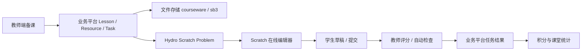
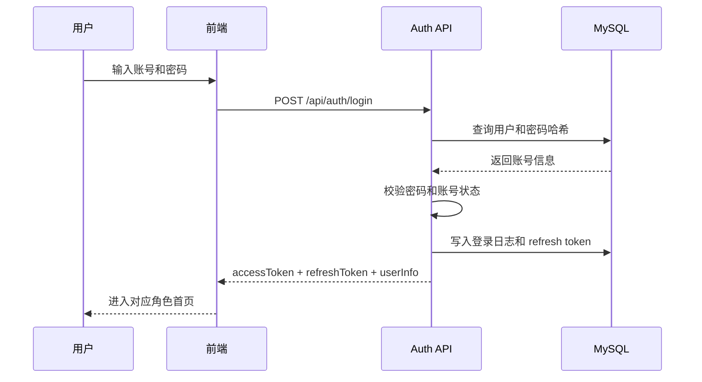

# Scratch 课堂备课与登录注册技术文档

版本：v1.0  
日期：2026-06-05  
适用范围：课程管理平台、教师端、学生端、管理后台、Hydro Scratch 插件对接

## 1. 文档目标

本文档在已有《技术文档(草稿).md》和 GitHub 公开仓库功能基础上，补充当前优先开发的两个业务方向：

1. Scratch 上课与备课模块：导入课件、导入模板作品、发布课堂任务、学生在线编辑和提交、教师查看与评分。
2. 登录与管理员注册模块：账号登录、JWT 鉴权、RBAC 权限、管理员注册或邀请、审计日志与安全策略。

本阶段不重新推翻已有课程管理系统设计，而是在现有「课程、班级、课次、签到、作业、Hydro、积分」主线之上补齐 Scratch 教学闭环和账号安全底座。

## 2. 参考依据

### 2.1 现有仓库能力

| 仓库 | 已具备信息 | 本文档采用方式 |
| --- | --- | --- |
| `moran-007/ceshi003` | 课程管理系统已有 `backend`、`frontend`、数据库 SQL、课程管理设计文档，技术栈描述为 Vue.js、Element UI、Node.js、MySQL、JWT、RBAC | 作为业务平台底座，继续沿用课程、班级、课时、签到、角色权限等设计方向 |
| `moran-007/hydro_scratch` | 已实现 Hydro Scratch 题目创建、在线编辑器、`.sb3` 模板加载、草稿保存、作品提交、手动评分、自动检查、Scratch 题目包导入导出 | 作为 Scratch 题目、模板作品、学生提交和教师评分的核心能力 |
| `moran-007/hydro_points` | 已实现积分账户、积分流水、签到积分、首次做题通过积分、规则配置、商城兑换、作业/比赛结算 | 后续课堂任务完成、作品提交和测评通过后可复用积分流水机制 |
| `技术文档(草稿).md` | 已给出业务平台与 Hydro 独立部署、插件/API/跳转同步的总体方案 | 本文档延续“业务平台是教学主系统，Hydro 是测评与 Scratch 作品引擎”的架构 |

### 2.2 外部技术依据

- Hydro 官方仓库说明其为高效信息学在线测评系统，并强调模块化设计、插件系统和多空间能力，适合继续采用插件扩展方式。
- `hydro_scratch` README 已列出 Scratch 相关路由、模板 `.sb3`、草稿、提交、评分、导入导出包能力。
- Scratch `.sb3` 文档说明 Scratch 3.0 项目扩展名为 `.sb3`，实际文件扩展等价于 `.zip`，因此导入时应做压缩包结构校验。
- RFC 7519 定义 JWT 是一种紧凑、URL 安全的 claims 表示方式，适合接口鉴权。
- OWASP Password Storage Cheat Sheet 建议密码不要明文存储，应使用 Argon2id、bcrypt、PBKDF2 等慢哈希算法；若使用 bcrypt，work factor 至少为 10。

## 3. 总体架构

本阶段推荐继续采用：

```txt
管理后台 / 教师端 / 学生端
        ↓
课程管理业务平台
        ↓
MySQL + 文件存储 + 操作日志
        ↓
Hydro 独立服务
        ↓
hydro_scratch 插件 + hydro_points 插件
```

业务平台负责：

- 账号、角色、管理员注册、登录鉴权。
- 校区、教师、学生、课程、班级、课次、签到、课时。
- 备课包、课件、课堂任务、作业发布。
- 业务侧的任务状态、学习记录、课堂统计。

Hydro 负责：

- Scratch 题目创建与配置。
- Scratch 模板作品、在线编辑、草稿保存。
- 学生 `.sb3` 提交。
- 教师预览、下载、手动评分。
- 静态检查、结构检查、动态检查。
- 题目包导入导出。
- 积分插件可继续负责签到、首次通过、作业/比赛结算和积分流水。

### 3.1 模块边界



关键原则：

- 课程和课次在业务平台中管理。
- Scratch 作品编辑、提交、评分优先走 `hydro_scratch`。
- 业务平台保存 Hydro 题目 ID、提交记录 ID、评分摘要，不直接依赖 Hydro 内部数据库结构。
- `.sb3` 模板文件可在业务平台作为备课资源存储，也可通过 `hydro_scratch` 题目包导入到 Hydro。

## 4. Scratch 备课模块

### 4.1 业务目标

教师在上课前可以完成以下动作：

- 选择课程、班级、课次。
- 上传本节课课件，例如 PDF、PPT、图片、视频、Markdown 教案。
- 上传 Scratch 模板作品 `.sb3`，用于学生打开后继续创作。
- 导入已有 Scratch 题目包 `.zip`，快速复用题面、模板、自动判题配置。
- 配置本节课的课堂任务、提交要求、评分规则和是否计入积分。
- 一键发布给班级学生。

### 4.2 核心对象

| 对象 | 说明 |
| --- | --- |
| 备课包 `lesson_prep` | 某一课次的教学资源集合 |
| 课件资源 `lesson_resource` | PDF、PPT、图片、视频、Markdown、外部链接 |
| Scratch 模板 `scratch_template` | 教师上传的 `.sb3` 模板作品 |
| Scratch 任务 `scratch_task` | 绑定课次、班级、Hydro 题目、模板、评分模式 |
| 发布记录 `task_publish` | 记录任务发布到哪些班级、学生、时间范围 |
| 学生任务结果 `student_task_result` | 学生打开、保存、提交、评分、完成状态 |

### 4.3 备课流程

```txt
教师进入备课页面
↓
选择课程、班级、课次
↓
上传课件资源
↓
上传或导入 Scratch 模板作品
↓
创建或绑定 Hydro Scratch 题目
↓
配置评分方式：手动 / 静态 / 动态 / 混合
↓
预览学生打开效果
↓
发布课堂任务
```

### 4.4 `.sb3` 导入校验

上传 Scratch 模板作品时，后端需要做基础校验：

- 文件扩展名允许 `.sb3`。
- MIME 类型允许 `application/zip`、`application/octet-stream` 等常见上传类型，但不只依赖 MIME。
- 文件大小建议第一期限制为 50 MB，可后台配置。
- 读取压缩包结构，必须包含 `project.json`。
- `project.json` 必须能解析为 JSON。
- 限制压缩包解压后的最大总大小，防止异常压缩包消耗资源。
- 计算 `sha256`，用于重复文件识别和版本追踪。

校验通过后保存文件元数据，不建议把 `.sb3` 直接存入数据库。

### 4.5 题目包导入

`hydro_scratch` 已支持 Hydro-native Scratch problem package，推荐将其作为教师复用题目的标准格式：

```txt
problem.yaml
statement.md
scratch-judge.json
template.sb3
```

导入方式建议分两类：

1. 业务平台导入：教师上传题目包，业务平台记录资源，再调用或跳转 Hydro 插件导入页。
2. Hydro 插件导入：教师直接进入 `/scratch/problem/import`，导入后将 `pid` 回填到业务平台的 Scratch 任务。

第一期建议采用第 2 种，开发量更小、风险更低。

### 4.6 备课页面功能

| 功能 | 教师端表现 | 后端动作 |
| --- | --- | --- |
| 新建备课包 | 选择课次后生成备课空间 | 创建 `lesson_prep` |
| 上传课件 | 拖拽上传，支持排序 | 写入 `lesson_resource` |
| 上传模板作品 | 上传 `.sb3`，可预览文件名和版本 | 写入 `scratch_template` |
| 绑定 Hydro 题目 | 输入 Hydro `pid` 或选择已创建题目 | 写入 `scratch_task.hydro_problem_id` |
| 配置评分 | 手动、静态、动态、混合 | 写入 `scratch_task.judge_mode` |
| 发布任务 | 选择班级或学生范围 | 写入 `task_publish` |
| 复制备课包 | 从历史课次复制课件、模板、任务配置 | 生成新版本记录 |

### 4.7 资源版本策略

备课资源建议支持版本，而不是简单覆盖：

```txt
template_v1.sb3
template_v2.sb3
```

原因：

- 已发布课堂任务不能因为教师再次上传模板而改变学生历史提交的基准。
- 教师需要追溯某节课当时使用的模板。
- 后续可以统计不同模板版本的完成率。

## 5. Scratch 上课模块

### 5.1 业务目标

教师上课时需要快速完成：

- 打开今日课程。
- 查看当前课次备课资源。
- 展示课件或打开 Scratch 模板。
- 发布或确认课堂任务。
- 查看学生是否打开任务、是否保存草稿、是否提交作品。
- 进入 Hydro Scratch 评分页。
- 对学生作品评分、点评、标记完成。

### 5.2 上课流程

```txt
教师进入今日课程
↓
打开课次详情
↓
签到 / 课消
↓
查看本节课课件和 Scratch 模板
↓
学生打开课堂任务
↓
学生在 Hydro Scratch 在线编辑器中保存草稿
↓
学生提交 .sb3
↓
教师查看提交队列
↓
手动评分或查看自动检查结果
↓
业务平台同步任务完成状态
↓
触发积分或课堂统计
```

### 5.3 学生端任务状态

| 状态 | 说明 |
| --- | --- |
| `NOT_STARTED` | 未打开任务 |
| `OPENED` | 已打开 Scratch 编辑器 |
| `DRAFT_SAVED` | 已保存草稿 |
| `SUBMITTED` | 已提交作品 |
| `REVIEWING` | 等待教师评分 |
| `PASSED` | 已通过 |
| `NEED_REWORK` | 需要修改 |
| `REJECTED` | 未通过 |

状态更新来源：

- 业务平台记录任务打开事件。
- `hydro_scratch` 记录草稿、提交、评分。
- 第一阶段可由教师手动同步评分结果。
- 第二阶段增加插件回调，由 Hydro 提交或评分后调用业务平台 API。

### 5.4 与 `hydro_scratch` 路由对应关系

| 场景 | Hydro Scratch 路由 |
| --- | --- |
| 创建 Scratch 题目 | `GET /scratch/problem/create` |
| 导入题目包 | `GET/POST /scratch/problem/import` |
| 编辑题目设置 | `GET/POST /scratch/problem/:pid/config` |
| 导出题目包 | `GET /scratch/problem/:pid/export` |
| 学生进入编辑器 | `GET /scratch/problem/:pid/editor` |
| 保存草稿 | `POST /scratch/problem/:pid/draft` |
| 提交作品 | `POST /scratch/submit/:pid` |
| 查看题目提交列表 | `GET /scratch/problem/:pid/submissions` |
| 预览学生提交 | `GET /scratch/submission/:rid/preview` |
| 查看自动检查报告 | `GET /scratch/submission/:rid/report` |
| 教师评分 | `GET/POST /scratch/submission/:rid/score` |
| 待评分队列 | `GET /scratch/review` |

### 5.5 上课页面建议

教师端「课次详情」页面建议拆为 5 个标签：

| 标签 | 功能 |
| --- | --- |
| 课堂概览 | 时间、班级、学生、签到、课消状态 |
| 备课资料 | 课件、教案、模板作品、外部链接 |
| Scratch 任务 | 任务标题、Hydro 题目、评分方式、发布范围 |
| 学生进度 | 打开、草稿、提交、评分、完成状态 |
| 课后处理 | 点评、积分、课后作业、下节课提醒 |

### 5.6 课堂实时进度

第一期可以轮询接口：

```txt
GET /api/teacher/lessons/:lessonId/scratch-progress
```

返回：

```json
{
  "lessonId": 1001,
  "taskId": 2001,
  "summary": {
    "total": 12,
    "opened": 11,
    "draftSaved": 9,
    "submitted": 6,
    "passed": 3
  },
  "students": [
    {
      "studentId": 1,
      "name": "张三",
      "status": "SUBMITTED",
      "lastDraftAt": "2026-06-05T10:20:00+08:00",
      "submittedAt": "2026-06-05T10:35:00+08:00",
      "score": 88,
      "hydroRecordId": "668f..."
    }
  ]
}
```

后期如需要实时性，再升级为 WebSocket 或 SSE。

## 6. 登录与管理员注册模块

### 6.1 业务目标

提供稳定、安全、可审计的账号入口：

- 管理员、教师、学生、家长均通过统一登录接口登录。
- 登录成功后返回 access token 和 refresh token。
- 后端接口基于 JWT 与 RBAC 做鉴权。
- 管理员注册不能完全开放，必须有初始化、邀请或超级管理员审批机制。
- 所有管理员创建、登录失败、权限变更都记录审计日志。

### 6.2 角色设计

| 角色 | 说明 |
| --- | --- |
| `SUPER_ADMIN` | 超级管理员，系统初始化后产生，拥有全部权限 |
| `ADMIN` | 校区或系统管理员，负责教师、学生、课程、班级等管理 |
| `TEACHER` | 教师，负责备课、上课、签到、评分、点评 |
| `STUDENT` | 学生，查看课程、进入 Scratch 任务、提交作品 |
| `PARENT` | 家长，查看孩子课程、课时、作品和通知 |

### 6.3 管理员注册策略

不建议开放「任何人可注册管理员」。推荐三种方式：

#### 方式 A：系统初始化注册超级管理员

适用于系统首次部署：

```txt
访问 /setup
↓
输入初始化密钥 SETUP_TOKEN
↓
创建首个 SUPER_ADMIN
↓
系统关闭 /setup 入口
```

约束：

- `SETUP_TOKEN` 必须来自环境变量。
- 数据库中已存在 `SUPER_ADMIN` 后，禁止再次初始化。
- 初始化操作写入 `audit_logs`。

#### 方式 B：超级管理员创建管理员

适用于正式运营：

```txt
SUPER_ADMIN 登录
↓
进入管理员管理
↓
创建 ADMIN 账号
↓
设置所属校区和角色
↓
系统发送初始密码或重置链接
```

#### 方式 C：管理员邀请注册

适用于多人协作：

```txt
SUPER_ADMIN 生成邀请链接
↓
邀请链接绑定角色、校区、过期时间
↓
被邀请人填写账号和密码
↓
注册成功后邀请链接失效
```

第一期建议实现方式 A + 方式 B。方式 C 可以放在第二期。

### 6.4 登录流程



### 6.5 Token 策略

| Token | 建议有效期 | 存储方式 | 用途 |
| --- | --- | --- | --- |
| Access Token | 15 到 30 分钟 | 前端内存或安全 Cookie | 调用业务 API |
| Refresh Token | 7 到 30 天 | HttpOnly Cookie 或服务端 session 表 | 刷新 access token |

JWT claims 建议：

```json
{
  "sub": "10001",
  "role": "TEACHER",
  "campusId": "1",
  "tokenVersion": 3,
  "iat": 1780646400,
  "exp": 1780648200
}
```

注意：

- JWT 中只放必要身份和权限摘要，不放手机号、身份证号、明文密码等敏感信息。
- 权限变更后增加 `tokenVersion`，让旧 token 失效。
- Refresh token 存储哈希值，不存明文。

### 6.6 密码策略

推荐：

- 新系统优先使用 Argon2id。
- 如果现有 Node.js 项目已经使用 bcrypt，可继续使用 bcrypt，但 `cost` 至少为 10，并根据服务器性能调到 12。
- 密码最小长度 8 位，管理员建议 10 位以上。
- 禁止常见弱密码。
- 密码永不明文存储。
- 登录失败连续 5 次后短时间锁定或要求验证码。

### 6.7 RBAC 权限模型

建议权限粒度：

```txt
auth.login
admin.create
admin.update
teacher.create
student.create
course.manage
class.manage
lesson.manage
lesson.prepare
lesson.teach
scratch.task.create
scratch.task.publish
scratch.task.review
attendance.manage
points.manage
audit.view
```

角色到权限映射示例：

| 角色 | 权限摘要 |
| --- | --- |
| `SUPER_ADMIN` | 全部权限 |
| `ADMIN` | 教师、学生、课程、班级、课次、管理员部分管理 |
| `TEACHER` | 备课、上课、签到、Scratch 任务、评分 |
| `STUDENT` | 查看课程、打开任务、保存草稿、提交作品 |
| `PARENT` | 查看孩子信息、课程、作品、课时 |

后端必须做权限校验，前端隐藏菜单只能作为体验优化。

## 7. 数据库设计

以下 SQL 以 MySQL 为基础，可根据已有 `course_management_system.sql` 合并字段命名。

### 7.1 用户与认证

```sql
CREATE TABLE users (
  id BIGINT PRIMARY KEY AUTO_INCREMENT,
  username VARCHAR(64) NOT NULL UNIQUE,
  phone VARCHAR(32) NULL UNIQUE,
  email VARCHAR(128) NULL UNIQUE,
  password_hash VARCHAR(255) NOT NULL,
  display_name VARCHAR(64) NOT NULL,
  avatar_url VARCHAR(255) NULL,
  status VARCHAR(32) NOT NULL DEFAULT 'ACTIVE',
  token_version INT NOT NULL DEFAULT 1,
  last_login_at DATETIME NULL,
  created_at DATETIME NOT NULL DEFAULT CURRENT_TIMESTAMP,
  updated_at DATETIME NOT NULL DEFAULT CURRENT_TIMESTAMP ON UPDATE CURRENT_TIMESTAMP
);

CREATE TABLE roles (
  id BIGINT PRIMARY KEY AUTO_INCREMENT,
  code VARCHAR(64) NOT NULL UNIQUE,
  name VARCHAR(64) NOT NULL,
  description VARCHAR(255) NULL,
  created_at DATETIME NOT NULL DEFAULT CURRENT_TIMESTAMP
);

CREATE TABLE user_roles (
  id BIGINT PRIMARY KEY AUTO_INCREMENT,
  user_id BIGINT NOT NULL,
  role_id BIGINT NOT NULL,
  campus_id BIGINT NULL,
  created_at DATETIME NOT NULL DEFAULT CURRENT_TIMESTAMP,
  UNIQUE KEY uk_user_role_campus (user_id, role_id, campus_id)
);

CREATE TABLE permissions (
  id BIGINT PRIMARY KEY AUTO_INCREMENT,
  code VARCHAR(128) NOT NULL UNIQUE,
  name VARCHAR(64) NOT NULL,
  module VARCHAR(64) NOT NULL
);

CREATE TABLE role_permissions (
  id BIGINT PRIMARY KEY AUTO_INCREMENT,
  role_id BIGINT NOT NULL,
  permission_id BIGINT NOT NULL,
  UNIQUE KEY uk_role_permission (role_id, permission_id)
);

CREATE TABLE refresh_tokens (
  id BIGINT PRIMARY KEY AUTO_INCREMENT,
  user_id BIGINT NOT NULL,
  token_hash VARCHAR(255) NOT NULL,
  device_info VARCHAR(255) NULL,
  ip_address VARCHAR(64) NULL,
  expires_at DATETIME NOT NULL,
  revoked_at DATETIME NULL,
  created_at DATETIME NOT NULL DEFAULT CURRENT_TIMESTAMP,
  INDEX idx_refresh_user (user_id),
  INDEX idx_refresh_expires (expires_at)
);
```

### 7.2 管理员邀请

第二期实现邀请注册时使用：

```sql
CREATE TABLE admin_invites (
  id BIGINT PRIMARY KEY AUTO_INCREMENT,
  invite_code VARCHAR(128) NOT NULL UNIQUE,
  role_code VARCHAR(64) NOT NULL,
  campus_id BIGINT NULL,
  created_by BIGINT NOT NULL,
  used_by BIGINT NULL,
  expires_at DATETIME NOT NULL,
  used_at DATETIME NULL,
  created_at DATETIME NOT NULL DEFAULT CURRENT_TIMESTAMP
);
```

### 7.3 Scratch 备课与任务

```sql
CREATE TABLE lesson_preps (
  id BIGINT PRIMARY KEY AUTO_INCREMENT,
  lesson_id BIGINT NOT NULL,
  title VARCHAR(128) NOT NULL,
  description TEXT NULL,
  created_by BIGINT NOT NULL,
  status VARCHAR(32) NOT NULL DEFAULT 'DRAFT',
  created_at DATETIME NOT NULL DEFAULT CURRENT_TIMESTAMP,
  updated_at DATETIME NOT NULL DEFAULT CURRENT_TIMESTAMP ON UPDATE CURRENT_TIMESTAMP,
  UNIQUE KEY uk_lesson_prep (lesson_id)
);

CREATE TABLE lesson_resources (
  id BIGINT PRIMARY KEY AUTO_INCREMENT,
  prep_id BIGINT NOT NULL,
  resource_type VARCHAR(32) NOT NULL,
  title VARCHAR(128) NOT NULL,
  file_url VARCHAR(500) NULL,
  external_url VARCHAR(500) NULL,
  file_size BIGINT NULL,
  file_hash VARCHAR(128) NULL,
  sort_order INT NOT NULL DEFAULT 0,
  created_by BIGINT NOT NULL,
  created_at DATETIME NOT NULL DEFAULT CURRENT_TIMESTAMP,
  INDEX idx_resource_prep (prep_id)
);

CREATE TABLE scratch_templates (
  id BIGINT PRIMARY KEY AUTO_INCREMENT,
  prep_id BIGINT NOT NULL,
  title VARCHAR(128) NOT NULL,
  file_url VARCHAR(500) NOT NULL,
  file_size BIGINT NOT NULL,
  file_hash VARCHAR(128) NOT NULL,
  version_no INT NOT NULL DEFAULT 1,
  created_by BIGINT NOT NULL,
  created_at DATETIME NOT NULL DEFAULT CURRENT_TIMESTAMP,
  INDEX idx_template_prep (prep_id),
  UNIQUE KEY uk_template_hash (prep_id, file_hash)
);

CREATE TABLE scratch_tasks (
  id BIGINT PRIMARY KEY AUTO_INCREMENT,
  lesson_id BIGINT NOT NULL,
  class_id BIGINT NOT NULL,
  prep_id BIGINT NULL,
  template_id BIGINT NULL,
  title VARCHAR(128) NOT NULL,
  description TEXT NULL,
  hydro_domain_id VARCHAR(64) NULL,
  hydro_problem_id VARCHAR(64) NULL,
  judge_mode VARCHAR(32) NOT NULL DEFAULT 'MANUAL',
  score_total INT NOT NULL DEFAULT 100,
  points_reward INT NOT NULL DEFAULT 0,
  start_at DATETIME NULL,
  end_at DATETIME NULL,
  status VARCHAR(32) NOT NULL DEFAULT 'DRAFT',
  created_by BIGINT NOT NULL,
  created_at DATETIME NOT NULL DEFAULT CURRENT_TIMESTAMP,
  updated_at DATETIME NOT NULL DEFAULT CURRENT_TIMESTAMP ON UPDATE CURRENT_TIMESTAMP,
  INDEX idx_scratch_lesson (lesson_id),
  INDEX idx_scratch_class (class_id)
);

CREATE TABLE student_task_results (
  id BIGINT PRIMARY KEY AUTO_INCREMENT,
  task_id BIGINT NOT NULL,
  student_id BIGINT NOT NULL,
  status VARCHAR(32) NOT NULL DEFAULT 'NOT_STARTED',
  hydro_record_id VARCHAR(128) NULL,
  score INT NULL,
  comment TEXT NULL,
  opened_at DATETIME NULL,
  last_draft_at DATETIME NULL,
  submitted_at DATETIME NULL,
  reviewed_at DATETIME NULL,
  reviewed_by BIGINT NULL,
  created_at DATETIME NOT NULL DEFAULT CURRENT_TIMESTAMP,
  updated_at DATETIME NOT NULL DEFAULT CURRENT_TIMESTAMP ON UPDATE CURRENT_TIMESTAMP,
  UNIQUE KEY uk_task_student (task_id, student_id),
  INDEX idx_result_status (task_id, status)
);
```

### 7.4 审计日志

```sql
CREATE TABLE audit_logs (
  id BIGINT PRIMARY KEY AUTO_INCREMENT,
  actor_user_id BIGINT NULL,
  action VARCHAR(128) NOT NULL,
  target_type VARCHAR(64) NULL,
  target_id VARCHAR(64) NULL,
  ip_address VARCHAR(64) NULL,
  user_agent VARCHAR(255) NULL,
  detail_json JSON NULL,
  created_at DATETIME NOT NULL DEFAULT CURRENT_TIMESTAMP,
  INDEX idx_audit_actor (actor_user_id),
  INDEX idx_audit_action (action),
  INDEX idx_audit_created (created_at)
);
```

## 8. API 设计

### 8.1 认证接口

| 方法 | 路径 | 权限 | 说明 |
| --- | --- | --- | --- |
| `POST` | `/api/auth/setup-admin` | 初始化密钥 | 首次创建超级管理员 |
| `POST` | `/api/auth/login` | 公开 | 用户登录 |
| `POST` | `/api/auth/refresh` | refresh token | 刷新 access token |
| `POST` | `/api/auth/logout` | 登录用户 | 当前设备退出 |
| `GET` | `/api/auth/me` | 登录用户 | 获取当前用户和权限 |
| `POST` | `/api/admin/users` | `admin.create` | 超级管理员创建管理员或教师 |
| `POST` | `/api/admin/invites` | `admin.create` | 生成管理员邀请链接，第二期 |
| `POST` | `/api/admin/invites/accept` | 邀请码 | 使用邀请链接注册管理员，第二期 |

登录请求：

```json
{
  "account": "admin",
  "password": "********",
  "captchaToken": "optional"
}
```

登录响应：

```json
{
  "accessToken": "jwt",
  "refreshToken": "refresh-token",
  "user": {
    "id": 1,
    "username": "admin",
    "displayName": "管理员",
    "roles": ["SUPER_ADMIN"],
    "permissions": ["lesson.prepare", "scratch.task.create"]
  }
}
```

### 8.2 Scratch 备课接口

| 方法 | 路径 | 权限 | 说明 |
| --- | --- | --- | --- |
| `POST` | `/api/teacher/lessons/:lessonId/prep` | `lesson.prepare` | 创建或更新备课包 |
| `GET` | `/api/teacher/lessons/:lessonId/prep` | `lesson.prepare` | 获取课次备课内容 |
| `POST` | `/api/teacher/preps/:prepId/resources` | `lesson.prepare` | 上传课件资源 |
| `DELETE` | `/api/teacher/resources/:resourceId` | `lesson.prepare` | 删除课件资源 |
| `POST` | `/api/teacher/preps/:prepId/scratch-templates` | `scratch.task.create` | 上传 `.sb3` 模板作品 |
| `POST` | `/api/teacher/scratch-tasks` | `scratch.task.create` | 创建 Scratch 课堂任务 |
| `POST` | `/api/teacher/scratch-tasks/:taskId/publish` | `scratch.task.publish` | 发布任务 |
| `GET` | `/api/teacher/lessons/:lessonId/scratch-progress` | `scratch.task.review` | 查看课堂进度 |
| `POST` | `/api/teacher/scratch-results/:resultId/review` | `scratch.task.review` | 写入教师评分和点评 |

### 8.3 学生端接口

| 方法 | 路径 | 权限 | 说明 |
| --- | --- | --- | --- |
| `GET` | `/api/student/lessons/today` | `STUDENT` | 获取今日课程 |
| `GET` | `/api/student/scratch-tasks/:taskId` | `STUDENT` | 获取任务详情 |
| `POST` | `/api/student/scratch-tasks/:taskId/open` | `STUDENT` | 标记已打开 |
| `GET` | `/api/student/scratch-tasks/:taskId/editor-url` | `STUDENT` | 获取 Hydro Scratch 编辑器跳转 URL |
| `GET` | `/api/student/scratch-results` | `STUDENT` | 查看自己的提交和评分 |

### 8.4 Hydro 回调接口

第二期建议新增：

| 方法 | 路径 | 权限 | 说明 |
| --- | --- | --- | --- |
| `POST` | `/api/integrations/hydro/scratch/submitted` | Hydro 签名 | Scratch 提交后同步状态 |
| `POST` | `/api/integrations/hydro/scratch/reviewed` | Hydro 签名 | 教师评分后同步分数 |
| `POST` | `/api/integrations/hydro/points/settled` | Hydro 签名 | 积分结算后同步摘要 |

回调必须校验签名：

```txt
X-Hydro-Timestamp
X-Hydro-Signature = HMAC_SHA256(secret, timestamp + "." + rawBody)
```

## 9. 权限控制

### 9.1 接口权限

后端统一中间件顺序：

```txt
解析 JWT
↓
读取用户状态和 tokenVersion
↓
加载角色与权限
↓
校验接口权限
↓
校验数据范围：校区、班级、教师归属
↓
执行业务逻辑
```

### 9.2 数据范围

教师只能访问：

- 自己负责的班级。
- 自己负责的课次。
- 已授权协作的课程资源。

管理员只能访问：

- 所属校区数据。
- 被授予的数据范围。

超级管理员可访问全部数据。

### 9.3 Scratch 任务安全

学生打开编辑器前，业务平台需要校验：

- 学生属于任务发布范围。
- 任务在有效时间内。
- 任务状态为 `PUBLISHED` 或 `ACTIVE`。
- Hydro 题目和当前业务任务存在绑定关系。

## 10. 文件存储设计

建议目录：

```txt
uploads/
  lesson-resources/
    {year}/{month}/{prepId}/{resourceId}.{ext}
  scratch-templates/
    {year}/{month}/{prepId}/{templateId}.sb3
  scratch-packages/
    {year}/{month}/{prepId}/{packageId}.zip
```

文件表只保存元数据：

- 原始文件名。
- 存储 URL。
- 文件大小。
- 文件 hash。
- 上传人。
- 上传时间。
- 所属课次或备课包。

访问控制：

- 管理员和任课教师可下载课件和模板。
- 学生只能访问已发布任务关联的资源。
- 私有文件不要直接暴露真实磁盘路径。

## 11. 开发实施计划

### 第一阶段：认证底座

目标：所有后台和教师端接口具备可靠鉴权。

任务：

- 创建用户、角色、权限、refresh token、审计日志表。
- 实现首次超级管理员初始化。
- 实现登录、刷新、退出、当前用户接口。
- 实现 RBAC 中间件。
- 实现超级管理员创建管理员。
- 登录失败记录和基础限流。

验收：

- 无超级管理员时可通过初始化密钥创建首个 `SUPER_ADMIN`。
- 已存在超级管理员后无法再次初始化。
- 管理员可登录并获取权限列表。
- 未登录访问教师端接口返回 401。
- 无权限访问管理接口返回 403。
- 密码不会明文入库。

### 第二阶段：Scratch 备课

目标：教师可以为课次准备课件和 Scratch 模板。

任务：

- 创建备课包。
- 上传课件资源。
- 上传 `.sb3` 模板并做基础校验。
- 创建 Scratch 课堂任务。
- 绑定 Hydro domain 和 problem id。
- 发布到班级。

验收：

- 教师能为某节课上传多个课件。
- 教师能上传 `.sb3` 模板，非法压缩包会被拒绝。
- 教师能绑定 Hydro Scratch 题目。
- 发布后学生端能看到任务。

### 第三阶段：Scratch 上课

目标：跑通课堂任务闭环。

任务：

- 学生端展示今日 Scratch 任务。
- 学生点击进入 Hydro Scratch 编辑器。
- 业务平台记录学生打开状态。
- 教师端查看学生进度。
- 教师端跳转 Hydro 提交列表、预览页、评分页。
- 教师评分后可手动回填业务平台结果。

验收：

- 学生可以从任务页打开对应 Hydro Scratch 编辑器。
- 教师能看到学生是否打开、提交、通过。
- 教师能进入 Hydro Scratch 评分页面。
- 评分结果能保存到业务平台。

### 第四阶段：Hydro 回调与积分联动

目标：减少人工同步。

任务：

- 在 `hydro_scratch` 增加提交和评分回调。
- 业务平台实现签名校验。
- 回调写入 `student_task_results`。
- 接入 `hydro_points` 或业务平台积分流水。

验收：

- 学生提交后业务平台状态自动变为 `SUBMITTED`。
- 教师评分后业务平台自动更新分数。
- 同一任务同一学生只发一次积分。

## 12. 测试用例

### 12.1 登录

| 用例 | 预期 |
| --- | --- |
| 正确账号密码登录 | 返回 token 和用户权限 |
| 错误密码登录 | 返回失败，记录失败次数 |
| 禁用账号登录 | 返回账号不可用 |
| token 过期访问接口 | 返回 401 |
| 无权限访问管理员创建接口 | 返回 403 |
| 退出后刷新 token | 返回失败 |

### 12.2 管理员注册

| 用例 | 预期 |
| --- | --- |
| 首次初始化超级管理员 | 创建成功 |
| 重复初始化超级管理员 | 拒绝 |
| 无初始化密钥创建超级管理员 | 拒绝 |
| 超级管理员创建普通管理员 | 创建成功 |
| 普通管理员创建超级管理员 | 拒绝 |

### 12.3 Scratch 备课

| 用例 | 预期 |
| --- | --- |
| 上传合法 `.sb3` | 保存成功 |
| 上传不含 `project.json` 的压缩包 | 拒绝 |
| 上传超大 `.sb3` | 拒绝 |
| 复制历史备课包 | 生成新备课资源 |
| 删除已发布任务使用的模板 | 不允许硬删除，只能下架或新版本替换 |

### 12.4 Scratch 上课

| 用例 | 预期 |
| --- | --- |
| 学生打开任务 | 状态变为 `OPENED` |
| 学生保存草稿 | Hydro 保存成功，业务平台可同步为 `DRAFT_SAVED` |
| 学生提交作品 | Hydro 生成提交记录 |
| 教师评分通过 | 状态变为 `PASSED` |
| 学生不在发布范围内访问任务 | 拒绝 |

## 13. 风险与处理

| 风险 | 影响 | 处理方式 |
| --- | --- | --- |
| 直接读取 Hydro 数据库 | Hydro 升级后业务平台容易失效 | 使用跳转、插件回调、API 同步 |
| 管理员注册开放 | 产生越权账号 | 只允许初始化密钥、超级管理员创建、邀请注册 |
| `.sb3` 文件不校验 | 可能造成异常文件上传和资源消耗 | 校验扩展名、压缩包、`project.json`、大小、hash |
| 评分结果重复同步 | 重复发积分或覆盖结果 | 使用 `task_id + student_id` 唯一约束和积分去重 key |
| 前端只隐藏按钮 | 接口仍可能被越权调用 | 后端 RBAC 和数据范围强校验 |
| 教师误改已发布模板 | 学生历史任务不一致 | 使用模板版本，不覆盖已发布版本 |

## 14. 第一版交付边界

第一版必须完成：

- 登录、刷新、退出、当前用户。
- 首个超级管理员初始化。
- 超级管理员创建管理员。
- 角色权限基础校验。
- 教师为课次创建备课包。
- 上传课件和 `.sb3` 模板。
- 创建并发布 Scratch 课堂任务。
- 学生查看任务并跳转 Hydro Scratch 编辑器。
- 教师查看进度并跳转 Hydro 评分页。

第一版暂不强制完成：

- 管理员邀请链接。
- Hydro 自动回调。
- WebSocket 实时进度。
- 自动导入 Hydro 题目包到业务平台。
- 复杂模板版本对比。
- 多端 App。

## 15. 参考链接

- GitHub 用户页：https://github.com/moran-007
- 课程管理系统仓库：https://github.com/moran-007/ceshi003
- Hydro Scratch 插件仓库：https://github.com/moran-007/hydro_scratch
- Hydro 积分插件仓库：https://github.com/moran-007/hydro_points
- Hydro 官方仓库：https://github.com/hydro-dev/Hydro
- Scratch `.sb3` 文件格式说明：https://scratchapi.org/File%20format/sb3/
- RFC 7519 JSON Web Token：https://datatracker.ietf.org/doc/html/rfc7519
- OWASP Password Storage Cheat Sheet：https://cheatsheetseries.owasp.org/cheatsheets/Password_Storage_Cheat_Sheet.html
- OWASP Authentication Cheat Sheet：https://cheatsheetseries.owasp.org/cheatsheets/Authentication_Cheat_Sheet.html
