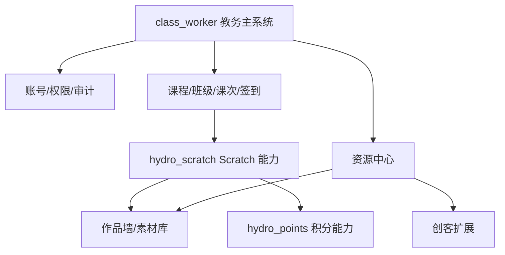

# 本地素材库与 worker 系统资产整合技术文档

版本：v2.2 本地资产补充版  
日期：2026-06-05  
扫描范围：`E:\moran_project`  
当前重点：完善技术文档，按功能目录取长补短，补齐素材库、课程内容库、worker 系统类资产与 Scratch 教学平台整合方案

## 1. 新增结论

本次根据本地路径 `E:\moran_project` 补充扫描后，前两版结论需要进一步优化：

- `worker`、`class_worker`、`class_worker1`、`class_worker1_My`、`class_worker2` 这类目录应按“系统类资产”理解，不是普通素材目录。
- 这些系统类目录基本按功能命名，能直接反映已有能力：课程管理、课时签到、积分、接口测试、数据库原型、拼豆工具、课纲知识点等。
- `class_worker` 已经比 GitHub 上的 `ceshi003` 更接近当前可运行的教务管理主系统，具备权限、课次、签到、统计、导出、日志、备份、Vue 管理端等成熟功能。
- `CStady` 和 `worker\课纲知识点` 是课程内容资产，应作为课件/讲义/课程资源库导入，而不是当作代码系统。
- `OJ_text\uploads` 和本地 Scratch GUI 资源是 Scratch 素材与模板来源，但其中包含大量依赖、测试夹具和重复资源，需要去重、筛选后再入库。
- `拼豆*` 和 `3d打印` 属于 STEAM/创客类扩展能力，可作为未来课程拓展，不应混入 Scratch 主流程。

因此，整个平台推荐从 v2.0 的：

```txt
ceshi003 + hydro_scratch + hydro_points
```

升级为更贴近本地资产的：

```txt
class_worker 作为教务/课次/签到/权限主系统
hydro_scratch 作为 Scratch 编辑、模板、提交、评分、测评主能力
hydro_points + jifen2 作为积分与学生激励参考
ScratchLite 作为素材库、默认作品、作品墙、批量账号的产品参考
CStady + 课纲知识点 + OJ_text uploads 作为课程内容和 Scratch 资源库
拼豆X/3d打印 作为未来 STEAM 扩展课程资产
```

## 2. 本地目录分类

### 2.1 顶层目录理解

| 目录 | 类型 | 当前定位 | 建议处理 |
| --- | --- | --- | --- |
| `class_worker` | 系统类 | 课时签到与课时统计管理系统 | 升级为教务主系统候选 |
| `class_worker1` | 系统类 | 教务系统前后端原型 | 作为结构参考 |
| `class_worker1_My` | 系统类 | 较早的教务管理版本 | 作为历史备份和功能对照 |
| `class_worker2` | 系统类 | `edu-system`，含 Docker 和登录调试 | 作为容器化/登录验证参考 |
| `worker` | 系统类合集 | 多个功能命名子系统 | 按功能拆分复用 |
| `worker_01` | 当前文档与扫描区 | GitHub 扫描结果、文档、ScratchLite | 保留为分析工作区 |
| `OJ_text` | Scratch OJ/资源 | 本地 Scratch 编辑器、上传资源、提交 | 资源筛选和 Scratch 原型参考 |
| `scratch-gui-develop` | Scratch GUI | 官方/本地 Scratch GUI 源码 | 编辑器资源参考 |
| `CStady` | 内容素材 | C++ 课程讲义、PPTX、阶段目录 | 课程内容库 |
| `3d打印` | 创客素材 | 3MF 模型文件 | 未来 STEAM 资源库 |
| `palettes` | 色板素材 | `perler_basic.json` | 拼豆/像素工具色库 |
| `projects` | 项目素材 | 当前未扫到明显资源文件 | 后续待补充 |

### 2.2 `worker` 子目录理解

| 目录 | 扫描文件数 | 功能判断 | 推荐价值 |
| --- | ---: | --- | --- |
| `ceshi003` | 70 | Node/Express/MySQL/Vue 课程管理系统 | MySQL 设计、API 文档参考 |
| `jifen2` | 193 | 学生积分管理系统 | 积分、出勤、JWT、Vue/Express 结构参考 |
| `moran_QD` | 29 | 前端/课堂 demo | UI 或课堂 demo 参考 |
| `Test01` | 64 | 数据库/API 原型 | 表结构演进参考 |
| `Test02` | 82 | 数据库/API 原型增强 | 登录尝试、初始化数据参考 |
| `Test03` | 9 | MySQL schema/view/procedure 原型 | SQL 视图、过程、种子数据参考 |
| `Test_04` | 13 | worker04 数据库结构和测试数据 | 数据库对照参考 |
| `其他` | 3 | 旧数据库等 | 只保留历史对照 |
| `课纲知识点` | 96 | C++ 课程讲义 | 课程资源库 |
| `拼豆` | 53 | 拼豆生成早期版本 | 历史参考 |
| `拼豆2` | 418 | 拼豆生成迭代版 | 图像转像素/图纸参考 |
| `拼豆2_Trea` | 112 | 拼豆工具重构版 | 架构文档参考 |
| `拼豆2_trea_CN` | 53 | 中文化拼豆工具 | 中文说明和模块化参考 |
| `拼豆3` | 420 | 拼豆工具继续迭代 | 架构重构参考 |
| `拼豆3_trea_CN` | 42 | 中文化拼豆应用 | 小型应用参考 |
| `拼豆4` | 709 | 拼豆 + Arduino/硬件 | 创客硬件课程参考 |
| `拼豆X` | 103 | 拼豆生成系统工程版 | 未来 STEAM 工具主参考 |

说明：文件数统计已排除常见依赖目录，例如 `node_modules`、`.git`、`dist`、`build`、`venv`、`.venv`、`__pycache__`。

## 3. `class_worker` 的主系统价值

`class_worker` 当前是最值得纳入主线的本地系统资产。

### 3.1 已具备能力

根据 `功能完成情况清单.md`、`权限管理模块说明.md`、`数据库设计与联表查询说明.md`、`管理系统文档.md`，它已实现：

| 模块 | 已有能力 |
| --- | --- |
| 启动运行 | Flask 主程序、Vue 前端、批处理/PowerShell 启动脚本 |
| 数据库 | SQLite 初始化、视图、常用查询、ER 说明，依赖中含 MySQL connector |
| 登录 | 登录、退出、个人密码修改 |
| 权限 | 超级管理员、校长、学管师、行政、教师、只读账号 |
| 后端权限 | 端点权限点、只读账号写入拦截、教师数据范围限制 |
| 前端权限 | Vue 路由权限、菜单/按钮权限控制 |
| 学生管理 | 学生增改查、停用、历史、课时余额 |
| 教师管理 | 教师增改查、停用、授课统计 |
| 班级管理 | 班级、班级学生维护、班级归档 |
| 预设课程库 | 课程大类、阶段、节次、课程名称、批量导入 |
| 课次排课 | 课次维护、批量生成课次、取消课程 |
| 签到扣课 | 班级签到、一键全员已到、按课程类型扣课 |
| 每节课详情 | 本节内容、教学目标、课堂表现、作业、下节安排、资料备注 |
| 统计导出 | 日/周/月/自定义统计、Excel 导出、统计图表基础 |
| 日志备份 | 操作日志、手动备份、下载、恢复 |
| Vue 管理端 | 学生、教师、班级、课程类型、预设课程、课次、签到、统计、账号、日志 |

### 3.2 对原技术路线的修正

前文把 `ceshi003` 作为课程管理底座。结合本地资产后，应调整为：

| 位置 | 原建议 | 新建议 |
| --- | --- | --- |
| 教务主系统 | `ceshi003` | 优先 `class_worker` |
| MySQL/API 参考 | `ceshi003` | 保留 `ceshi003` 的 MySQL 设计和 API 文档 |
| 权限模型 | 待重构 | 优先吸收 `class_worker` 权限点和角色分级 |
| 课次/签到/统计 | `ceshi003` 作为基础 | 优先吸收 `class_worker` 已完成逻辑 |
| 备份/日志 | 原文较少 | 吸收 `class_worker` 操作日志和备份机制 |

### 3.3 仍需补齐

`class_worker` 适合做主系统，但仍需补：

- 正式生产认证：密码哈希、登录失败限流、会话安全。
- 多实例/云端部署：当前偏本地/局域网。
- 课时购买流水、课时到期提醒、收费订单。
- 自动备份、保留策略。
- 学生/家长端。
- 与 Scratch 编辑器、模板作品、素材库、作品提交的集成。

## 4. 素材与课程资源扫描

### 4.1 C++ 课程内容资源

`E:\moran_project\CStady`：

| 类型 | 数量 | 说明 |
| --- | ---: | --- |
| `.md` | 73 | C++/信息学奥赛课程讲义、习题、知识拓展 |
| `.pptx` | 2 | 变量、一维数组课件 |

目录结构：

```txt
CStady
  PPTX
  预备知识
  第一部分_启蒙阶段
  第二部分_基础阶段
  第三部分_进阶阶段
  第四部分_进阶阶段
  竞赛准备
  辅助资源
```

`E:\moran_project\worker\课纲知识点`：

| 类型 | 数量 | 说明 |
| --- | ---: | --- |
| `.md` | 96 | 讲义、课程知识点、48 课时类内容 |

建议：

- 作为“课程内容库”导入，不作为 Scratch 素材库。
- 按路径自动解析课程阶段、章节、课时号、标题。
- Markdown 可直接进入课程内容编辑器或转为课件。
- PPTX 作为课件附件，与课次或预设课程绑定。

### 4.2 Scratch 资源

定向扫描 `OJ_text\uploads`、`OJ_text\scratch_GUI`、`scratch-gui-develop\static`、`uuuu\scratch-gui-develop\static` 后识别到：

| 类型 | 数量 | 说明 |
| --- | ---: | --- |
| `.png` | 5616 | Scratch GUI、教学步骤、上传素材、静态图片 |
| `.svg` | 1792 | Scratch 角色/造型/图标等 |
| `.gif` | 661 | 动画或引导素材 |
| `.wav` | 405 | Scratch 音效 |
| `.sb2` | 222 | 旧版 Scratch 项目/测试夹具 |
| `.mp3` | 141 | 音频素材 |
| `.sb3` | 139 | Scratch 3 项目/测试夹具/提交 |
| `.jpg` | 108 | 图片素材 |
| `.sprite3` | 18 | Scratch 角色包 |
| `.zip` | 2 | 压缩资源 |

需要注意：

- 很多资源位于 `scratch_GUI\node_modules` 或测试夹具目录，不应全部入库。
- `OJ_text\uploads\scratch-assets` 有约 1337 个上传 Scratch 素材，价值更高。
- `OJ_text\uploads\submissions` 有 47 个提交类 Scratch 文件，可作为历史提交/测评样本。
- `OJ_text\uploads\editor-projects` 有编辑器项目样本。

建议分层导入：

| 来源 | 入库策略 |
| --- | --- |
| `OJ_text\uploads\scratch-assets` | 优先作为真实 Scratch 素材导入 |
| `OJ_text\uploads\submissions` | 作为提交样本或历史作品导入 |
| `OJ_text\uploads\editor-projects` | 作为模板/草稿样本导入 |
| `scratch_GUI\packages\...` | 只选官方素材库和默认项目，不导入测试夹具 |
| `scratch_GUI\node_modules\...` | 原则上不导入，避免重复 |

### 4.3 ScratchLite 素材库对照

前一版扫描到 `ScratchLite`：

- `material_tags`
- `material_backdrop`
- `material_sprite`
- `material_costume`
- `material_sound`
- `data/material/asset` 约 1339 个素材文件

这套结构适合做素材库产品模型参考，但当前平台的真实导入来源可以结合：

```txt
ScratchLite data/material/asset
+ OJ_text uploads/scratch-assets
+ 本地 Scratch GUI 官方素材
```

### 4.4 创客/STEAM 资源

`E:\moran_project\3d打印`：

| 类型 | 数量 | 示例 |
| --- | ---: | --- |
| `.3mf` | 2 | `WQF.3mf`、`小王.3mf` |

`E:\moran_project\worker\拼豆X`：

| 类型 | 数量 | 说明 |
| --- | ---: | --- |
| `.py` | 52 | 图像处理、拼豆生成、工具脚本 |
| `.png` | 19 | 示例图片/图纸 |
| `.json` | 16 | 色板/配置 |
| `.md` | 5 | 技术说明 |
| `.csv` | 2 | 数据表 |
| `.ino` | 1 | Arduino 示例 |

建议：

- 作为“创客课程资源/工具模块”独立管理。
- 后期可以扩展到拼豆图纸生成、像素画课程、硬件课程。
- 当前 Scratch 上课/备课主线中只记录为未来扩展，不优先接入。

## 5. 取长补短的总体方案

### 5.1 各资产最适合承担的角色

| 资产 | 最适合复用的长处 | 需要规避/补齐的短处 |
| --- | --- | --- |
| `class_worker` | 课次、签到、权限、统计、日志、备份、Vue 管理端 | 需接入 Scratch、正式认证、多端部署 |
| `ceshi003` | MySQL 课程管理 schema、API 文档 | 登录认证弱，系统成熟度低于 `class_worker` |
| `hydro_scratch` | `.sb3` 校验、模板、提交、评分、自动测评 | 需与教务课次绑定 |
| `hydro_points` | 积分流水、去重、商城、称号 | 需与课程和作品事件打通 |
| `jifen2` | Vue/Express/JWT/学生积分管理 | 需避免与 `hydro_points` 重复造轮子 |
| `ScratchLite` | 默认作品、素材库、作品墙、点赞收藏、批量账号 | 代码安全和架构不适合直接生产 |
| `OJ_text` | Scratch OJ 原型、上传素材、提交样本 | 旧原型，不作为主线系统 |
| `CStady` | C++ 课程讲义和 PPTX | 不是 Scratch 素材，需要课程内容导入流程 |
| `课纲知识点` | 课时化讲义内容 | 需整理重复标题和课时编号 |
| `拼豆X/3d打印` | 创客工具和硬件课程 | 作为未来模块，不进入当前 MVP |

### 5.2 新主架构



### 5.3 当前 MVP 应优先做什么

| 优先级 | 模块 | 来源 |
| --- | --- | --- |
| P0 | 登录、管理员、角色权限、审计 | `class_worker` + 重写安全认证 |
| P0 | 课次、班级、学生、教师、签到 | `class_worker` |
| P1 | 预设课程库 + 课件导入 | `class_worker` + `CStady` + `课纲知识点` |
| P1 | Scratch 模板作品导入 | `hydro_scratch` + `ScratchLite` 默认作品思路 |
| P1 | 学生课堂作品副本 | `hydro_scratch` |
| P2 | Scratch 素材库 | `ScratchLite` + `OJ_text\uploads\scratch-assets` |
| P2 | 作品提交、评分、教师点评 | `hydro_scratch` + `class_worker` 课次详情 |
| P3 | 作品墙、点赞、收藏、开源 | `ScratchLite` |
| P3 | 积分激励 | `hydro_points` + `jifen2` |
| P4 | 拼豆/3D 打印/创客课程 | `拼豆X` + `3d打印` |

## 6. 资源中心设计

为了避免“素材、课件、作品、系统文件”混在一起，建议新增统一资源中心。

### 6.1 资源类型

| 类型 | 示例 |
| --- | --- |
| `course_markdown` | `CStady`、`课纲知识点` 的 `.md` |
| `courseware_pptx` | PPTX 课件 |
| `scratch_project` | `.sb3`、`.sb2` |
| `scratch_sprite` | `.sprite3` |
| `scratch_image` | `.png`、`.svg`、`.jpg`、`.gif` |
| `scratch_sound` | `.wav`、`.mp3` |
| `maker_model` | `.3mf`、`.stl`、`.obj` |
| `maker_palette` | `.json` 色板 |
| `document` | 其他教学文档 |

### 6.2 推荐表结构

```txt
resource_asset
  id
  source_root              # CStady/OJ_text/ScratchLite/worker
  source_path
  type
  title
  extension
  mime_type
  size_bytes
  content_hash
  object_key
  metadata_json
  status                   # discovered/imported/reviewed/enabled/archived
  created_at
  updated_at
```

```txt
resource_collection
  id
  name
  type                     # course/scratch_material/maker/system_reference
  source_root
  description
  created_by
  created_at
```

```txt
resource_collection_item
  collection_id
  asset_id
  sort_order
```

```txt
course_resource_bind
  id
  course_preset_id
  lesson_id
  asset_id
  usage_type               # lecture/courseware/template/material/homework
```

### 6.3 路径解析规则

建议导入时自动解析路径：

```txt
E:\moran_project\CStady\第二部分_基础阶段\2.4_数组\2.4.1_一维数组.md
```

解析为：

```txt
source_root = CStady
stage = 第二部分_基础阶段
chapter = 2.4_数组
lesson_no = 2.4.1
title = 一维数组
type = course_markdown
```

Scratch 资源：

```txt
E:\moran_project\OJ_text\uploads\scratch-assets\xxx.svg
```

解析为：

```txt
source_root = OJ_text
collection = scratch-assets
type = scratch_image
extension = .svg
```

## 7. 系统整合建议

### 7.1 教务系统

以 `class_worker` 为主系统候选，吸收：

- 角色分级和权限点设计。
- 教师数据范围限制。
- 预设课程库。
- 批量生成课次。
- 每节课详情。
- 签到扣课。
- 统计导出。
- 操作日志。
- 备份恢复。

需要升级：

- 密码哈希和登录安全。
- 数据库从 SQLite 平滑迁移到 MySQL/PostgreSQL 的方案。
- API 模块化，避免单个 `app.py` 过大。
- 与 Scratch/Hydro 服务之间的账号和课次绑定。

### 7.2 Scratch 上课/备课

以 `hydro_scratch` 为核心，吸收：

- `.sb3` 导入校验。
- Scratch 编辑器嵌入。
- 模板作品。
- 草稿和提交。
- 预览、报告、人工评分。
- 自动测评和复核。

从 `ScratchLite` 吸收：

- 默认作品理念。
- 素材库分类。
- 作品发布、播放、开源。
- 点赞、收藏。

从 `OJ_text` 吸收：

- 上传素材和提交样本。
- Scratch OJ 原型的本地编辑器经验。

### 7.3 积分系统

优先以 `hydro_points` 的流水模型为准，`jifen2` 作为 UI/API/学生积分管理经验参考。

积分事件建议：

```txt
attendance.arrived
lesson.homework.submitted
scratch.work.published
scratch.work.featured
scratch.work.liked
course.challenge.passed
```

注意：

- 不能只在学生表里直接加积分。
- 必须有积分流水、去重键、撤销机制。
- 作品点赞等事件要防刷和限流。

### 7.4 素材库

素材库不是一个目录，而是多个来源的整合：

```txt
ScratchLite data/material/asset
OJ_text uploads/scratch-assets
Scratch GUI 官方素材
CStady 课程文档与 PPTX
worker/课纲知识点
3d打印/拼豆X 创客资源
```

平台内应分成：

- Scratch 素材库。
- 课程内容库。
- 课件附件库。
- 学生作品库。
- 创客资源库。
- 系统参考资产库。

## 8. 新增实施路线

### 阶段一：整理资源清单

任务：

- 建立资源扫描脚本。
- 排除依赖目录和测试夹具。
- 按来源生成资源清单。
- 对文件计算 hash 去重。
- 输出待导入列表。

优先扫描：

```txt
E:\moran_project\CStady
E:\moran_project\worker\课纲知识点
E:\moran_project\OJ_text\uploads
E:\moran_project\worker_01\github_scan_scratchlite_20260605\data\material
E:\moran_project\3d打印
E:\moran_project\worker\拼豆X
```

### 阶段二：确定主系统

建议优先对 `class_worker` 做一次技术审计：

- 登录安全。
- 数据库迁移。
- API 模块化。
- 权限中间件。
- 前端构建。
- 课次/签到/统计是否满足当前业务。

如果继续沿用 `class_worker`，则 `ceshi003` 只作为 MySQL 设计参考，不再作为主系统。

### 阶段三：接入 Scratch 能力

任务：

- 课次绑定 Scratch 模板作品。
- 学生进入课次后复制模板。
- 保存学生 Scratch 作品。
- 提交作品到教师待评。
- 教师在课次详情中查看作品和点评。

### 阶段四：建设素材库

任务：

- 导入 Scratch 图片、声音、角色包。
- 建立素材分类。
- 绑定课程/课次素材包。
- 管理员审核素材。
- 教师选择本课素材包。

### 阶段五：积分和作品墙

任务：

- 建立作品发布/审核流程。
- 接入点赞、收藏、开源。
- 作品推荐触发积分。
- 签到、提交、优秀作品进入积分流水。

## 9. 需要避免的问题

| 问题 | 风险 | 建议 |
| --- | --- | --- |
| 把 `E:\moran_project` 全部当素材导入 | 会导入源码、依赖、日志、测试夹具 | 必须按来源和类型筛选 |
| 把 `worker` 当普通素材目录 | 会丢失系统资产价值 | 按功能系统分类 |
| 继续多套课程系统并行 | 维护成本高 | 选 `class_worker` 作为当前主系统候选 |
| 直接导入 `node_modules` 下 Scratch 资源 | 重复、噪声、版权/依赖混乱 | 只选官方素材库和真实上传目录 |
| 直接复用 ScratchLite 后端 | 安全风险 | 只复用产品模型 |
| 积分系统同时维护多套余额 | 数据不一致 | 统一积分流水 |
| Markdown/PPTX 不做结构化 | 课件难以检索 | 路径解析 + 元数据入库 |

## 10. 最终整合蓝图

```txt
教务主系统
  class_worker
  - 权限
  - 学生/教师/班级
  - 预设课程
  - 课次
  - 签到
  - 统计
  - 日志/备份

Scratch 教学系统
  hydro_scratch
  - 模板导入
  - 编辑器
  - 学生作品
  - 提交
  - 测评/评分

资源中心
  CStady
  worker/课纲知识点
  OJ_text/uploads
  ScratchLite/material
  Scratch GUI 官方素材
  拼豆X/3d打印

积分激励
  hydro_points
  jifen2 作为参考

作品与素材运营
  ScratchLite 产品模型
  - 素材库
  - 默认作品
  - 作品墙
  - 点赞收藏
  - 批量账号
```

当前最稳的下一步：

```txt
1. 以 class_worker 为主系统候选做技术审计
2. 建立本地资源扫描/去重/入库清单
3. 把 CStady 和 课纲知识点 导入课程内容库
4. 把 OJ_text uploads 和 ScratchLite material 导入 Scratch 素材库
5. 在课次详情中增加 Scratch 模板作品绑定
6. 再接入 hydro_scratch 的编辑/提交/评分
```

## 11. 本次扫描依据

重点路径：

- `E:\moran_project`
- `E:\moran_project\class_worker`
- `E:\moran_project\class_worker1`
- `E:\moran_project\class_worker1_My`
- `E:\moran_project\class_worker2`
- `E:\moran_project\worker`
- `E:\moran_project\CStady`
- `E:\moran_project\OJ_text`
- `E:\moran_project\scratch-gui-develop`
- `E:\moran_project\3d打印`
- `E:\moran_project\palettes`

重点参考文件：

- `E:\moran_project\class_worker\功能完成情况清单.md`
- `E:\moran_project\class_worker\权限管理模块说明.md`
- `E:\moran_project\class_worker\数据库设计与联表查询说明.md`
- `E:\moran_project\class_worker\管理系统文档.md`
- `E:\moran_project\worker\jifen2\cs\README.md`
- `E:\moran_project\worker\jifen2\cs\package.json`
- `E:\moran_project\worker\拼豆X\readme.md`
- `E:\moran_project\CStady`
- `E:\moran_project\worker\课纲知识点`
- `E:\moran_project\OJ_text\uploads`
